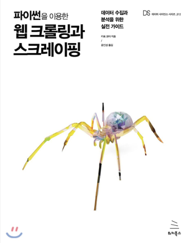

# ML/DL Based Core Industry Big Data Analysis Expert Course

Python For BigData @ <a href='https://www.facebook.com/jskim.kr'>FB / jskim.kr</a>, [김진수](bigpycraft@gmail.com)

## IITP 2018, Innovation Growth Intensive Training in MultiCampus
>  
- Python Programming Basics
- Python Modules for Data Analysis
- Data Analysis Practice for BigData
- <b>Web Crawling and Scraping</b>

### TextBook : Web Crawling & Scraping

<table align="left">
    <tr align="left">
        <td width="300">
            
        </td>
        <td width="700">

01. <a href="https://htmlpreview.github.io/?https://github.com/bigpycraft/iitp18-multicampus/blob/master/section-D/html/WCS01_Wget_크롤링.html              "> 크롤링과 스크레이핑이란?                  </a>
  
02. <a href="https://htmlpreview.github.io/?https://github.com/bigpycraft/iitp18-multicampus/blob/master/section-D/html/WCS02_크롤링과_스크랩핑_ver2.html   "> 파이썬으로 시작하는 크롤링/스크레이핑     </a>
  
03. <a href="https://htmlpreview.github.io/?https://github.com/bigpycraft/iitp18-multicampus/blob/master/section-D/html/WCS03_주요_라이브러리_활용_ver2.html"> 주요 라이브러리 활용                      </a>
  
04. <a href="https://htmlpreview.github.io/?https://github.com/bigpycraft/iitp18-multicampus/blob/master/section-D/html/WCS04_크롤러사용_ver2.html          "> 크롤러를 사용할 때 기억해야 하는 것       </a>
  
04. <a href="https://htmlpreview.github.io/?https://github.com/bigpycraft/iitp18-multicampus/blob/master/section-D/html/WCS05_데이터활용_ver3.html          "> 크롤링/스크레이핑 실전과 데이터 활용      </a>
  

</td>
    </tr>
</table>
 

### Wget for Windows
> GNU Wget : HTTP통신 또는 FTP 통신을 사용해 서버에서 파일 또는 콘텐츠를 다운로드할 때 사용하는 소프트웨어
* download : https://eternallybored.org/misc/wget/

<marquee>The BigpyCraft find the information to design valuable society with Technology & Craft.</marquee>

 &lt; The End &gt; 

