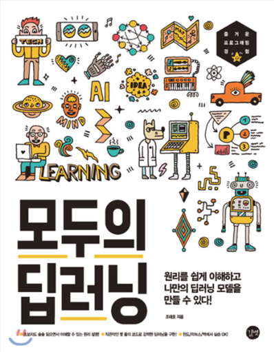

# ML/DL Based Core Industry Big Data Analysis Expert Course

Python For BigData @ <a href='https://www.facebook.com/jskim.kr'>FB / jskim.kr</a>, [김진수](bigpycraft@gmail.com)

## IITP 2018, Innovation Growth Intensive Training in MultiCampus
>  
- [Section-A][link-A] : Python Programming Basics 
- [Section-B][link-B] : Python Modules for Data Analysis
- ♣ [Midterm Test][test10] : Python Core Programming   
- [Section-C][link-C] : Data Analysis Practice for BigData
- [Section-D][link-D] : Web Crawling and Scraping
- ♣ [Team Project][test11] : Keyword Data Analysis by Topic   
- [Section-E][link-E] : Machine Learning
- <b>[Section-F][link-F] : Deep Learning</b>
- ♣ [Team Project][test12] : Challenge Kaggle for Machine Learning   

[link-A]: https://github.com/bigpycraft/iitp18-multicampus/tree/master/section-A "Go Section-A"
[link-B]: https://github.com/bigpycraft/iitp18-multicampus/tree/master/section-B "Go Section-B"
[link-C]: https://github.com/bigpycraft/iitp18-multicampus/tree/master/section-C "Go Section-C"
[link-D]: https://github.com/bigpycraft/iitp18-multicampus/tree/master/section-D "Go Section-D"
[link-E]: https://github.com/bigpycraft/iitp18-multicampus/tree/master/section-E "Go Section-E"
[link-F]: https://github.com/bigpycraft/iitp18-multicampus/tree/master/section-F "Go Section-F"
[test10]: https://github.com/bigpycraft/iitp18-multicampus/tree/master/test-py10 "Go Test-10"
[test11]: https://github.com/bigpycraft/iitp18-multicampus/tree/master/test-py11 "Go Test-11"
[test12]: https://github.com/bigpycraft/iitp18-multicampus/tree/master/test-py12 "Go Test-12"

### TextBook : Deep Learning for BigData, 모두의 딥러닝

<table align="left">
    <tr align="left">
        <td width="300">
            
        </td>
        <td width="50">
        </td>
        <td width="300">

 [첫째 마당] 나의 첫 딥러닝
 1장. 최고급 요리를 먹을 시간 
 2장. 처음 해 보는 딥러닝 
  
 [둘째 마당] 딥러닝의 동작 원리
 3장. 가장 훌륭한 예측선 긋기: 선형 회귀 
 4장. 오차 수정하기: 경사 하강법
 5장. 참 거짓 판단 장치: 로지스틱 회귀 
  
 [셋째 마당] 신경망의 이해
 6장. 퍼셉트론 
 7장. 다층 퍼셉트론 
 8장. 오차 역전파 
 9장. 신경망에서 딥러닝으로
 
 

        </td>
        <td width="300">

 [넷째 마당] 딥러닝 기본기 다지기
 10장 모델 설계하기 
 11장 데이터 다루기 
 &nbsp;&nbsp;&nbsp;&nbsp;[실습] 피마 인디언 당뇨병 예측
 12장 다중 분류 문제 해결하기 
 &nbsp;&nbsp;&nbsp;&nbsp;[실습] 아이리스 품종 예측
 13장 과적합 피하기 
 &nbsp;&nbsp;&nbsp;&nbsp;[실습] 초음파 광물 예측
 14장 베스트 모델 만들기 
 &nbsp;&nbsp;&nbsp;&nbsp;[실습] 와인의 종류 예측
 15장 선형 회귀 적용하기 
 &nbsp;&nbsp;&nbsp;&nbsp;[실습] 보스턴 집값 예측
  
 [다섯째 마당] 딥러닝의 활용
 16장. 이미지 인식의 꽃, CNN 익히기
 17장. 시퀀스 배열로 다루는 순환 신경망(RNN) 

</td>
    </tr>
</table>
 

### Data Set
- [housing.csv                       ][data-set-01]
- [iris.csv                          ][data-set-02]
- [pima-indians-diabetes.csv         ][data-set-03]
- [sonar.csv                         ][data-set-04]
- [ThoraricSurgery.csv               ][data-set-05]
- [wine.csv                          ][data-set-06]

### Deep Class
- [01_Linear_Regression.py           ][deep-class-01]
- [02_RMSE.py                        ][deep-class-02]
- [03_Gradient_Descent.py            ][deep-class-03]
- [04_Multi-Linear-Regression.py     ][deep-class-04]
- [05_3D_Graph.py                    ][deep-class-05]
- [06_Logistic_Regression.py         ][deep-class-06]
- [07_Multi_Logistic_Regression.py   ][deep-class-07]
- [08_XOR.py                         ][deep-class-08]
- [09_XOR-backpropagation.py         ][deep-class-09]

### Deep Code
- [01_My_First_Deeplearning.py       ][deep-code-01]
- [02_Data_preparation.py            ][deep-code-021]
- [02_Pima_Indian.py                 ][deep-code-022]
- [03_Iris_Multi_Classfication.py    ][deep-code-03]
- [04-Sonar.py                       ][deep-code-04]
- [05_Sonar_Train_Test.py            ][deep-code-05]
- [06-Sonar-Save-Model.py            ][deep-code-06]
- [07_Sonar-K-fold.py                ][deep-code-07]
- [08_Wine.py                        ][deep-code-08]
- [09_Wine_Checkpoint.py             ][deep-code-09]
- [10_Wine_Overfit_Graph.py          ][deep-code-10]
- [11_Wine_Early_Stop.py             ][deep-code-11]
- [12_Wine_Check_and_Stop.py         ][deep-code-12]
- [13_Boston.py                      ][deep-code-13]
- [14_MNIST_Data.py                  ][deep-code-14]
- [15_MNIST_Simple.py                ][deep-code-15]
- [16_MNIST_Deep.py                  ][deep-code-16]
- [17_RNN1_Reuters.py                ][deep-code-171]
- [17_RNN2_imdb_lstm.py              ][deep-code-172]

[data-set-01]: https://github.com/bigpycraft/iitp18-multicampus/blob/master/textbook-deeplearning/dataset/housing.csv                          "Go Data-01"
[data-set-02]: https://github.com/bigpycraft/iitp18-multicampus/blob/master/textbook-deeplearning/dataset/iris.csv                             "Go Data-02"
[data-set-03]: https://github.com/bigpycraft/iitp18-multicampus/blob/master/textbook-deeplearning/dataset/pima-indians-diabetes.csv            "Go Data-03"
[data-set-04]: https://github.com/bigpycraft/iitp18-multicampus/blob/master/textbook-deeplearning/dataset/sonar.csv                            "Go Data-04"
[data-set-05]: https://github.com/bigpycraft/iitp18-multicampus/blob/master/textbook-deeplearning/dataset/ThoraricSurgery.csv                  "Go Data-05"
[data-set-06]: https://github.com/bigpycraft/iitp18-multicampus/blob/master/textbook-deeplearning/dataset/wine.csv                             "Go Data-06"

[deep-class-01]: https://github.com/bigpycraft/iitp18-multicampus/blob/master/textbook-deeplearning/deep_class/01_Linear_Regression.py          "Go Class-01"
[deep-class-02]: https://github.com/bigpycraft/iitp18-multicampus/blob/master/textbook-deeplearning/deep_class/02_RMSE.py                       "Go Class-02"
[deep-class-03]: https://github.com/bigpycraft/iitp18-multicampus/blob/master/textbook-deeplearning/deep_class/03_Gradient_Descent.py           "Go Class-03"
[deep-class-04]: https://github.com/bigpycraft/iitp18-multicampus/blob/master/textbook-deeplearning/deep_class/04_Multi-Linear-Regression.py    "Go Class-04"
[deep-class-05]: https://github.com/bigpycraft/iitp18-multicampus/blob/master/textbook-deeplearning/deep_class/05_3D_Graph.py                   "Go Class-05"
[deep-class-06]: https://github.com/bigpycraft/iitp18-multicampus/blob/master/textbook-deeplearning/deep_class/06_Logistic_Regression.py        "Go Class-06"
[deep-class-07]: https://github.com/bigpycraft/iitp18-multicampus/blob/master/textbook-deeplearning/deep_class/07_Multi_Logistic_Regression.py  "Go Class-07"
[deep-class-08]: https://github.com/bigpycraft/iitp18-multicampus/blob/master/textbook-deeplearning/deep_class/08_XOR.py                        "Go Class-08"
[deep-class-09]: https://github.com/bigpycraft/iitp18-multicampus/blob/master/textbook-deeplearning/deep_class/09_XOR-backpropagation.py        "Go Class-09"

[deep-code-01]:  https://github.com/bigpycraft/iitp18-multicampus/blob/master/textbook-deeplearning/deep_code/01_My_First_Deeplearning.py       "Go Code-01"
[deep-code-021]: https://github.com/bigpycraft/iitp18-multicampus/blob/master/textbook-deeplearning/deep_code/02_Data_preparation.py            "Go Code-021"
[deep-code-022]: https://github.com/bigpycraft/iitp18-multicampus/blob/master/textbook-deeplearning/deep_code/02_Pima_Indian.py                 "Go Code-022"
[deep-code-03]:  https://github.com/bigpycraft/iitp18-multicampus/blob/master/textbook-deeplearning/deep_code/03_Iris_Multi_Classfication.py    "Go Code-03"
[deep-code-04]:  https://github.com/bigpycraft/iitp18-multicampus/blob/master/textbook-deeplearning/deep_code/04-Sonar.py                       "Go Code-04"
[deep-code-05]:  https://github.com/bigpycraft/iitp18-multicampus/blob/master/textbook-deeplearning/deep_code/05_Sonar_Train_Test.py            "Go Code-05"
[deep-code-06]:  https://github.com/bigpycraft/iitp18-multicampus/blob/master/textbook-deeplearning/deep_code/06-Sonar-Save-Model.py            "Go Code-06"
[deep-code-07]:  https://github.com/bigpycraft/iitp18-multicampus/blob/master/textbook-deeplearning/deep_code/07_Sonar-K-fold.py                "Go Code-07"
[deep-code-08]:  https://github.com/bigpycraft/iitp18-multicampus/blob/master/textbook-deeplearning/deep_code/08_Wine.py                        "Go Code-08"
[deep-code-09]:  https://github.com/bigpycraft/iitp18-multicampus/blob/master/textbook-deeplearning/deep_code/09_Wine_Checkpoint.py             "Go Code-09"
[deep-code-10]:  https://github.com/bigpycraft/iitp18-multicampus/blob/master/textbook-deeplearning/deep_code/10_Wine_Overfit_Graph.py          "Go Code-10"
[deep-code-11]:  https://github.com/bigpycraft/iitp18-multicampus/blob/master/textbook-deeplearning/deep_code/11_Wine_Early_Stop.py             "Go Code-11"
[deep-code-12]:  https://github.com/bigpycraft/iitp18-multicampus/blob/master/textbook-deeplearning/deep_code/12_Wine_Check_and_Stop.py         "Go Code-12"
[deep-code-13]:  https://github.com/bigpycraft/iitp18-multicampus/blob/master/textbook-deeplearning/deep_code/13_Boston.py                      "Go Code-13"
[deep-code-14]:  https://github.com/bigpycraft/iitp18-multicampus/blob/master/textbook-deeplearning/deep_code/14_MNIST_Data.py                  "Go Code-14"
[deep-code-15]:  https://github.com/bigpycraft/iitp18-multicampus/blob/master/textbook-deeplearning/deep_code/15_MNIST_Simple.py                "Go Code-15"
[deep-code-16]:  https://github.com/bigpycraft/iitp18-multicampus/blob/master/textbook-deeplearning/deep_code/16_MNIST_Deep.py                  "Go Code-16"
[deep-code-171]: https://github.com/bigpycraft/iitp18-multicampus/blob/master/textbook-deeplearning/deep_code/17_RNN1_Reuters.py                "Go Code-171"
[deep-code-172]: https://github.com/bigpycraft/iitp18-multicampus/blob/master/textbook-deeplearning/deep_code/17_RNN2_imdb_lstm.py              "Go Code-172"

### TensorFlow

<table align="left">
    <tr align="left">
        <td width="200">
            
        </td>
        <td width="800">

    <b> - TensorFlow.org </b> : https://www.tensorflow.org/
       - An open source machine learning library for research and production.
      
    <b> 1. TenforFlow Install  : <a href='https://www.tensorflow.org/install/'>[설치가이드]</a>
      
    <b> 2. TenforFlow Develop : <a href='https://www.tensorflow.org/tutorials/'>[튜토리얼]</a>
      
    <b> 3. TensorFlow Community </b> : <a href='https://www.tensorflow.org/community/'>[커뮤니티]</a>
      
    <b> cf. Environment : Install a Python 3.5.x or Python 3.6.x 64-bit release for Windows </b>

        </td>
    </tr>
</table>
 

<h3> Jupyter Notebook </h3>

<table align="left">
    <tr align="left">
        <td width="200">
            
        </td>
        <td width="800">

<b> Latest : Version 5.3 | Release Date: September 28, 2018 </b>
 
- Filename : Anaconda3-5.3.0-Windows-x86_64.exe 
 
- Download : https://www.anaconda.com/download/
 
- Check the OS version & bit (32bit / 64bit)

 

<b> Recommand : Version 5.2 | Release Date: May 30, 2018 </b>
 
- Filename : Anaconda3-5.2.0-Windows-x86_64.exe
 
- Download : https://repo.continuum.io/archive/ 
 
- Reason : TF Requires Python 3.4, 3.5, or 3.6 
 
- TensorFlow : https://www.tensorflow.org/install/pip

</td>
    </tr>
</table>
 

### Microsoft Azuer Notebooks

<table align="left">
    <tr align="left">
        <td width="200">
            
        </td>
        <td width="800">

- <b> Microsoft Azure Notebooks </b> : https://notebooks.azure.com/
  
- Interactive coding in my browser
  
- Free, in the cloud, powered by jupyter

</td>
    </tr>
</table>
 

<marquee>The BigpyCraft find the information to design valuable society with Technology & Craft.</marquee>

 &lt; The End &gt; 

