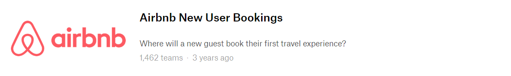
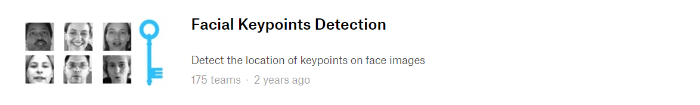
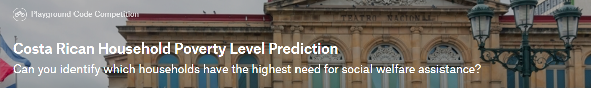
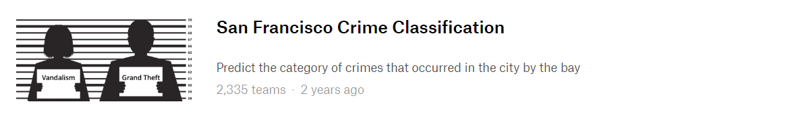

# ML/DL Based Core Industry Big Data Analysis Expert Course

Python For BigData @ <a href='https://www.facebook.com/jskim.kr'>FB / jskim.kr</a>, [김진수](bigpycraft@gmail.com)

## IITP 2018, Innovation Growth Intensive Training in MultiCampus
>  
- [Section-A][link-A] : Python Programming Basics 
- [Section-B][link-B] : Python Modules for Data Analysis
- ♣ [Midterm Test][test10] : Python Core Programming   
- [Section-C][link-C] : Data Analysis Practice for BigData
- [Section-D][link-D] : Web Crawling and Scraping
- ♣ [Team Project][test11] : Keyword Data Analysis by Topic   
- [Section-E][link-E] : Machine Learning
- [Section-F][link-F] : Deep Learning
- ♣ <b>[Team Project][test12] : Challenge Kaggle for Machine Learning </b>  
  

[link-A]: https://github.com/bigpycraft/iitp18-multicampus/tree/master/section-A "Go Section-A"
[link-B]: https://github.com/bigpycraft/iitp18-multicampus/tree/master/section-B "Go Section-B"
[link-C]: https://github.com/bigpycraft/iitp18-multicampus/tree/master/section-C "Go Section-C"
[link-D]: https://github.com/bigpycraft/iitp18-multicampus/tree/master/section-D "Go Section-D"
[link-E]: https://github.com/bigpycraft/iitp18-multicampus/tree/master/section-E "Go Section-E"
[link-F]: https://github.com/bigpycraft/iitp18-multicampus/tree/master/section-F "Go Section-F"
[test10]: https://github.com/bigpycraft/iitp18-multicampus/tree/master/test-py10 "Go Test-10"
[test11]: https://github.com/bigpycraft/iitp18-multicampus/tree/master/test-py11 "Go Test-11"
[test12]: https://github.com/bigpycraft/iitp18-multicampus/tree/master/test-py12 "Go Test-12"

### Kaggle

<table align="left">
    <tr align="left">
        <td width="200">
            
        </td>
        <td width="800">

    <b> - Kaggle.com </b> : https://www.kaggle.com/
      - Kaggle is the place to do data science projects
      
    <b> 1. Kaggle Competitions : <a href='https://www.kaggle.com/competitions/'>[경진대회]</a>
     
    <b> 2. Kaggle Datasets : <a href='https://www.kaggle.com/datasets/'>[데이터셋]</a>
      
    <b> cf. Exception Task : Titanic ML & Digit Recognizer with MNIST data  </b>
     

        </td>
    </tr>
</table>
 

## Team Project 

- 2nd Subject : Challenge Kaggle 
- Our Motto : <b>Learning by doing, doing by learning !! </b>
- Report Format : <a href="./report/IITP18_혁신성장과정_0팀_샘플.docx">착수보고서 양식</a>

<table border=1 bgcolor="#EEEEEE">
	<tr bgcolor="#CC0000">
		<td width="100">
<b>팀명    </b>
</td>
		<td width="200">
<b>프로젝트팀</b>
</td>
		<td width="500">
<b>주제 및 링크</b>
</td>
		<td width="100">
<b>보고    </b>
</td>
	</tr>
	<tr>
		<td>
A팀 <b>[하드캐리]</b>
</td>
		<td>
팀장 : 강호영 팀원 : 유영재, 이상훈
</td>
		<td>
			
 Otto Group 제품 분류 과제

			

		</td>
		<td>
<a href="report/S10_착수보고서_A팀.pdf">[착수보고서]</a>
</td>
	</tr>
	<tr>
		<td>
B팀 <b>[여행조하]</b>
</td>
		<td>
팀장 : 유수정 팀원 : 김홍기, 김하준
</td>
		<td>
			

 Airbnb 신규 사용자 예약

			

		</td>
		<td>
<a href="report/S10_착수보고서_B팀.pdf">[착수보고서]</a>
</td>
	</tr>
	<tr>
		<td>
C팀 <b>[제이씨제이]</b>
</td>
		<td>
팀장 : 장은경 팀원 : 정민호, 주상훈
</td>
		<td>
			
얼굴 특징 감지

			

		</td>
		<td>
<a href="report/S10_착수보고서_C팀.pdf">[착수보고서]</a>
</td>
	</tr>
	<tr>
		<td>
D팀 <b>[팀명D]</b>
</td>
		<td>
팀장 : 조민정 팀원 : 고준형, 김효신
</td>
		<td>
			
주택 가격 : 고급 회귀 기법

			

		</td>
		<td>
<a href="report/S10_착수보고서_D팀.pdf">[착수보고서]</a>
</td>
	</tr>
	<tr>
		<td>
E팀 <b>[원픽]</b>
</td>
		<td>
팀장 : 문정연 팀원 : 공정배, 이진수
</td>
		<td>
			
코스타리카 가계 빈곤 수준 예측

			

		</td>
		<td>
<a href="report/S10_착수보고서_E팀.pdf">[착수보고서]</a>
</td>
	</tr>
	<tr>
		<td>
F팀 <b>[듀란듀란]</b>
</td>
		<td>
팀장 : 민유진, 함윤선 팀원 : 유선우, 장정호
</td>
		<td>
			
샌프란시스코 범죄 예측

			

		</td>
		<td>
<a href="report/S10_착수보고서_F팀.pdf">[착수보고서]</a>
</td>
	</tr>
</table>

## Articles & News

- <a href="http://www.asiae.co.kr/news/view.htm?idxno=2018111911582199902">삼성전자, 대졸공채에 '파이썬' 도입</a>
- <a href="http://news.mk.co.kr/newsRead.php?year=2017&no=489532&fbclid=IwAR2aK3GJBuer_ksU_HqlPyLyMJbnQHfvRCKIOK3X4heR93LOJmRndnSWLDY">빅데이터 만능 시대…'데이터 달인'이 만능인재</a> 

<marquee>The BigpyCraft find the information to design valuable society with Technology & Craft.</marquee>

 &lt; The End &gt; 

