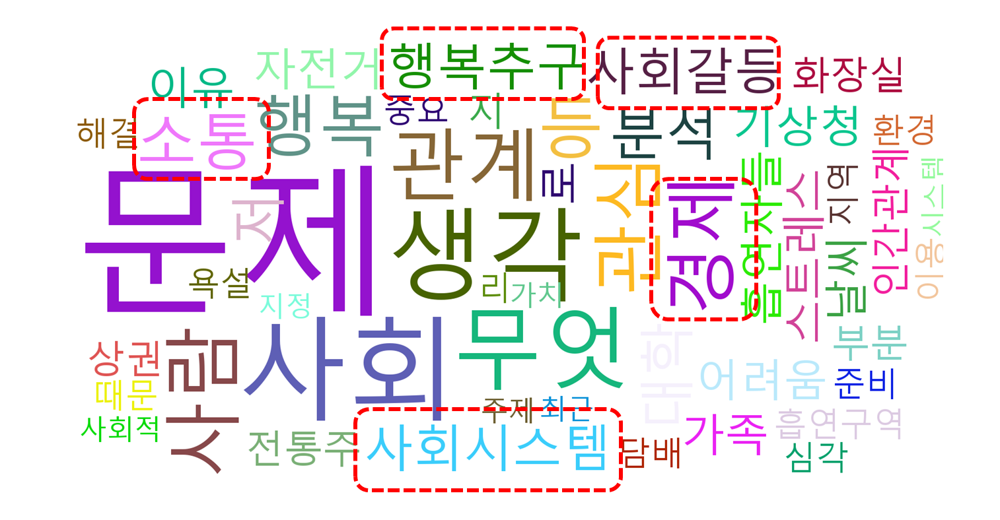
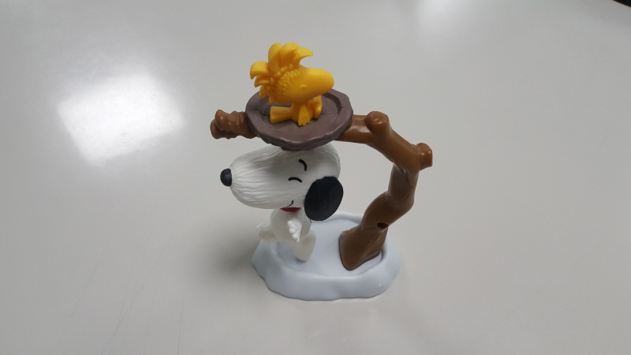
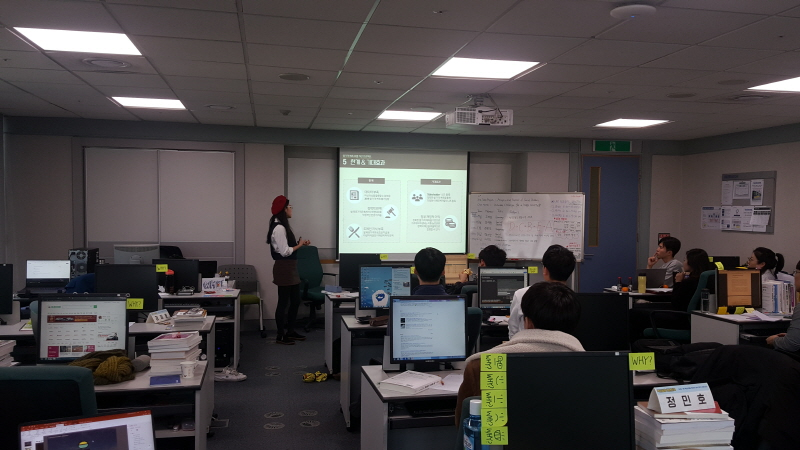
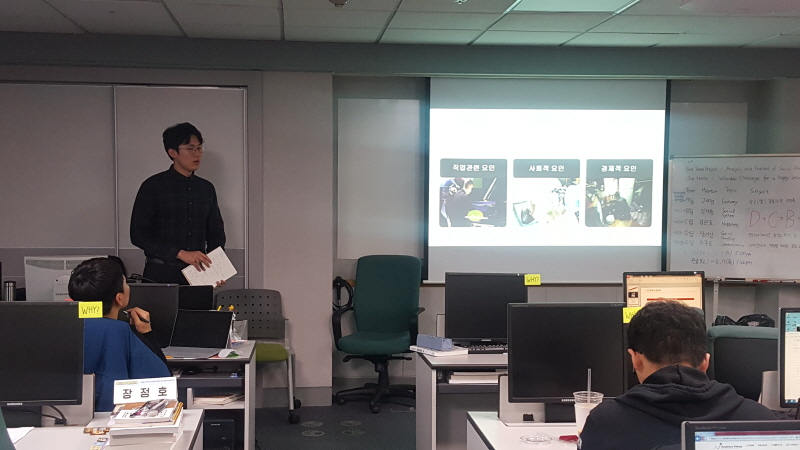
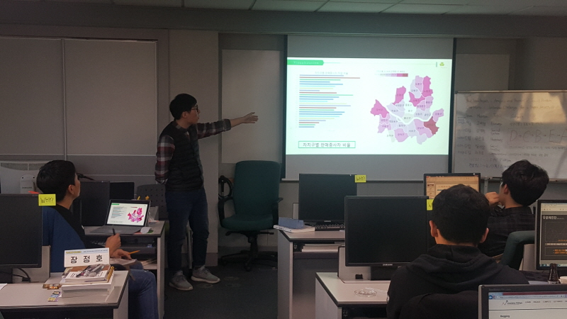
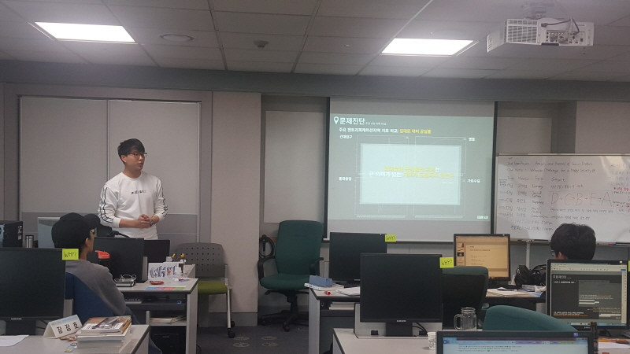
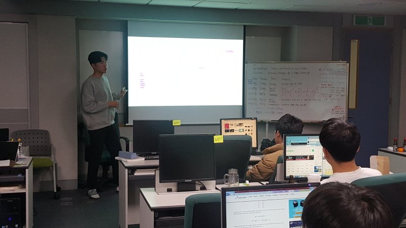

# ML/DL Based Core Industry Big Data Analysis Expert Course

Python For BigData @ <a href='https://www.facebook.com/jskim.kr'>FB / jskim.kr</a>, [김진수](bigpycraft@gmail.com)

## IITP 2018, Innovation Growth Intensive Training in MultiCampus
>  
- [Section-A][link-A] : Python Programming Basics 
- [Section-B][link-B] : Python Modules for Data Analysis
- ♣ [Midterm Test][test10] : Python Core Programming   
- [Section-C][link-C] : Data Analysis Practice for BigData
- [Section-D][link-D] : Web Crawling and Scraping
- ♣ [Team Project][test11] : Keyword Data Analysis by Topic   
- [Section-E][link-E] : Machine Learning
- [Section-F][link-F] : Deep Learning
- ♣ <b>[Team Project][test12] : Challenge Kaggle for Machine Learning </b>  
  

[link-A]: https://github.com/bigpycraft/iitp18-multicampus/tree/master/section-A "Go Section-A"
[link-B]: https://github.com/bigpycraft/iitp18-multicampus/tree/master/section-B "Go Section-B"
[link-C]: https://github.com/bigpycraft/iitp18-multicampus/tree/master/section-C "Go Section-C"
[link-D]: https://github.com/bigpycraft/iitp18-multicampus/tree/master/section-D "Go Section-D"
[link-E]: https://github.com/bigpycraft/iitp18-multicampus/tree/master/section-E "Go Section-E"
[link-F]: https://github.com/bigpycraft/iitp18-multicampus/tree/master/section-F "Go Section-F"
[test10]: https://github.com/bigpycraft/iitp18-multicampus/tree/master/test-py10 "Go Test-10"
[test11]: https://github.com/bigpycraft/iitp18-multicampus/tree/master/test-py11 "Go Test-11"
[test12]: https://github.com/bigpycraft/iitp18-multicampus/tree/master/test-py12 "Go Test-12"

## Team Project : Kick Off

* 3rd Subject : Analysis & Proposal of Social Problem.
* Our Motto : <b>Valuable Challenge for A Happy Society !! </b>
* Project Schedule : 2018.12.01(토) ~ 2018.12.13(목) 
* 참고 문서
    - <a href="./docu/IITP18_UNIT1_사회문제분석1.ppsm">빅데이터 프로젝트 클래스C반 문제도출</a>
    - <a href="./docu/IITP18_UNIT1_사회문제분석2.ppsm">빅데이터 프로젝트 클래스C반 팀빌딩 및 프로젝트 개요</a>
    - <a href="./docu/IITP18_UNIT1_문제정의서_포맷.pptx">문제정의서 포맷</a>
    - <a href="./docu/IITP18_UNIT1_착수보고서_포맷.docx">착수보고서 포맷</a>

<h2>결과보고서 발표</h2>
 
<h4>A팀 : 고재형멘토 - 이코노미</h4>
<table border=1>
	<tr>
		<td width="200">
<b>Project Team</b>
</td>
		<td width="600">
 ECONOMY(최소비용최대효율)팀
</td>
	</tr>
	<tr>
		<td>
<b>Team Members</b>
</td>
		<td>
 강호영, 김효신, 문정연, 주상훈
</td>
	</tr>
	<tr>
		<td>
<b>Report</b>
</td>
		<td>
            
 
                <a href="report/IITP18_UNIT1_결과보고서_A팀_v1.pdf">[A팀 결과보고 1차]</a>, &nbsp;&nbsp;&nbsp; 
                <a href="report/IITP18_UNIT1_결과보고서_A팀_v2.pdf">[A팀 결과보고 2차]</a> 
            

        </td>
	</tr>
	<tr>
		<td>
<b>Subject</b>
</td>
		<td>
회귀분석을 활용한 쌀 가격 예측 모델 개선
</td>
	</tr>
	<tr>
		<td>
<b>Presentation</b>
</td>
		<td>

</td>
	</tr>
</table>

 
<h4>B팀 : 강재원멘토 - 사회적구조</h4>
<table border=1>
	<tr>
		<td width="200">
<b>Project Team</b>
</td>
		<td width="800">
 사시미(사회 시스템에 미친)팀
</td>
	</tr>
	<tr>
		<td>
<b>Team Members</b>
</td>
		<td>
 유선우, 김하준, 공정배, 함윤선
</td>
	</tr>
	<tr>
		<td>
<b>Report</b>
</td>
		<td>
            
 
                <a href="report/IITP18_UNIT1_결과보고서_B팀_v1.pdf">[B팀 결과보고 1차]</a>, &nbsp;&nbsp;&nbsp; 
                <a href="report/IITP18_UNIT1_결과보고서_B팀_v2.pdf">[B팀 결과보고 2차]</a> 
            

        </td>
	</tr>
	<tr>
		<td>
<b>Subject</b>
</td>
		<td>
현 장애 등급제 실태 파악 개선 방안 제시
</td>
	</tr>
	<tr>
		<td>
<b>Presentation</b>
</td>
		<td>

</td>
	</tr>
</table>

 
<h4>C팀 김한호멘토 - 해피니스</h4>
<table border=1>
	<tr>
		<td width="200">
<b>Project Team</b>
</td>
		<td width="800">
 샴록(Shamrock)팀
</td>
	</tr>
	<tr>
		<td>
<b>Team Members</b>
</td>
		<td>
 김홍기, 정민호, 장정호, 민유진
</td>
	</tr>
	<tr>
		<td>
<b>Report</b>
</td>
		<td>
            
 
                <a href="report/IITP18_UNIT1_결과보고서_C팀_v1.pdf">[C팀 결과보고 1차]</a>, &nbsp;&nbsp;&nbsp; 
                <a href="report/IITP18_UNIT1_결과보고서_C팀_v2.pdf">[C팀 결과보고 2차]</a> 
            

        </td>
	</tr>
	<tr>
		<td>
<b>Subject</b>
</td>
		<td>
서울시 50+세대의 삶의 만족도 높이기 위한 사회 공헌형 일자리 분석
</td>
	</tr>
	<tr>
		<td>
<b>Presentation</b>
</td>
		<td>

</td>
	</tr>
</table>

 
<h4>D팀 : 길기상멘토 - 사회적갈등</h4>
<table border=1>
	<tr>
		<td width="200">
<b>Project Team</b>
</td>
		<td width="600">
 GTA팀
</td>
	</tr>
	<tr>
		<td>
<b>Team Members</b>
</td>
		<td>
 조민정, 고준형, 유영재, 이진수
</td>
	</tr>
	<tr>
		<td>
<b>Report</b>
</td>
		<td>
            
 
                <a href="report/IITP18_UNIT1_결과보고서_D팀_v1.pdf">[D팀 결과보고 1차]</a>, &nbsp;&nbsp;&nbsp; 
                <a href="report/IITP18_UNIT1_결과보고서_D팀_v2.pdf">[D팀 결과보고 2차]</a> 
            

        </td>
	</tr>
	<tr>
		<td>
<b>Subject</b>
</td>
		<td>
젠트리피케이션 심각도 파악 및 완화 정책 타당성 분석
</td>
	</tr>
	<tr>
		<td>
<b>Presentation</b>
</td>
		<td>

</td>
	</tr>
</table>

 
<h4>E팀 : 허주용 - 커뮤니케이션</h4>
<table border=1>
	<tr>
		<td width="200">
<b>Project Team</b>
</td>
		<td width="600">
 신의눈물(Tears of God)팀
</td>
	</tr>
	<tr>
		<td>
<b>Team Members</b>
</td>
		<td>
 장은경, 유수정, 이상훈
</td>
	</tr>
	<tr>
		<td>
<b>Report</b>
</td>
		<td>
            
 
                <a href="report/IITP18_UNIT1_결과보고서_E팀_v1.pdf">[E팀 결과보고 1차]</a>, &nbsp;&nbsp;&nbsp; 
                <a href="report/IITP18_UNIT1_결과보고서_E팀_v2.pdf">[E팀 결과보고 2차]</a> 
            

        </td>
	</tr>
	<tr>
		<td>
<b>Subject</b>
</td>
		<td>
미세먼지의 심각성 분석
</td>
	</tr>
	<tr>
		<td>
<b>Presentation</b>
</td>
		<td>

</td>
	</tr>
</table>

 
<h2>The seriousness of thesocial problem in Korea</h2>
 
<video src="media/social_problem.mp4" autoplay controls width="800">
 
<a href="https://htmlpreview.github.io/?https://github.com/bigpycraft/iitp18-multicampus/blob/master/unit-bpc01/media/social_problem.html">[PLAY]</a>

<marquee>The BigpyCraft find the information to design valuable society with Technology & Craft.</marquee>

 &lt; The End &gt; 

